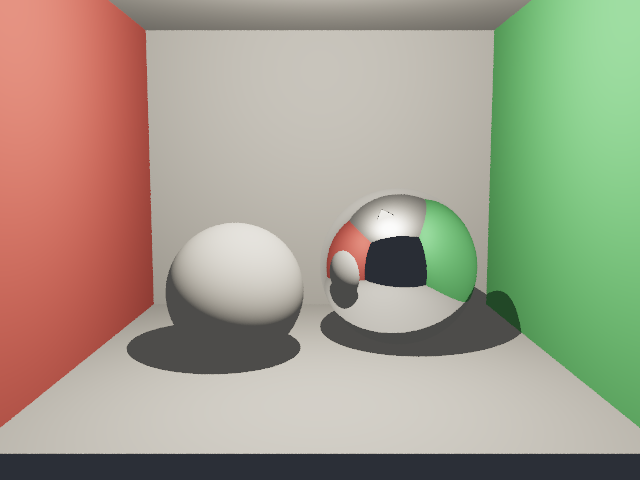
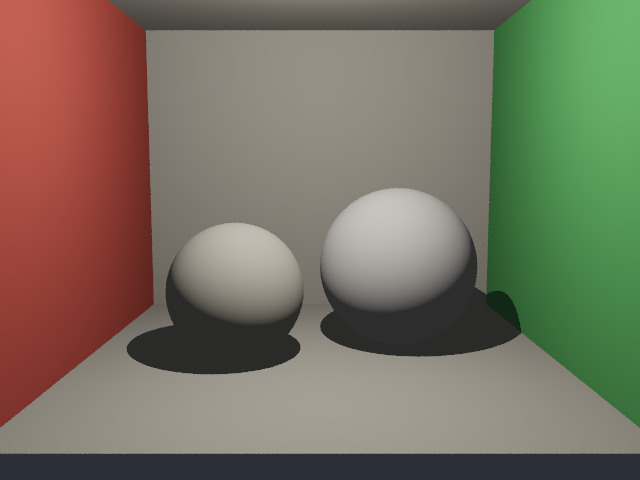
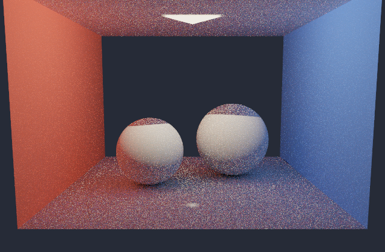
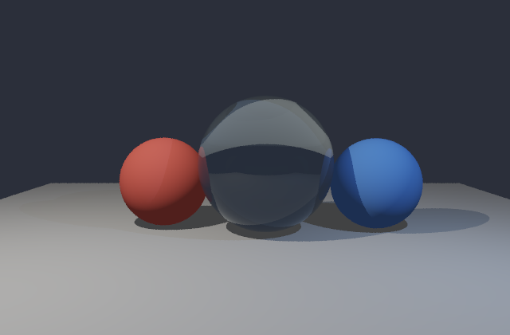
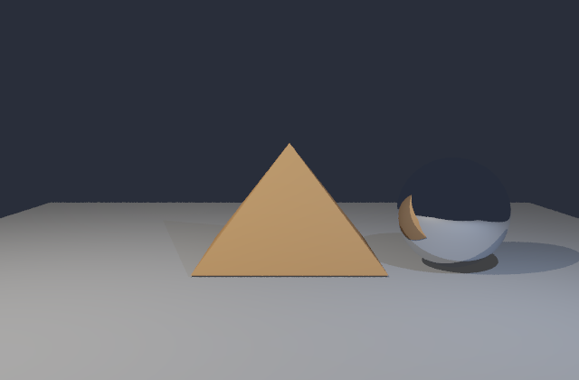
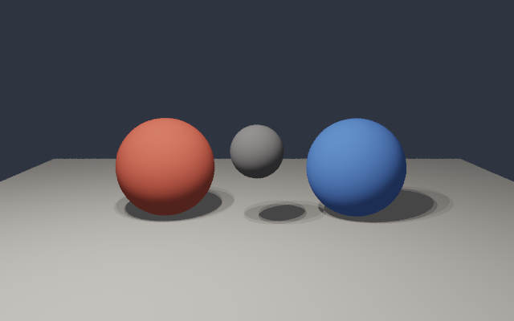
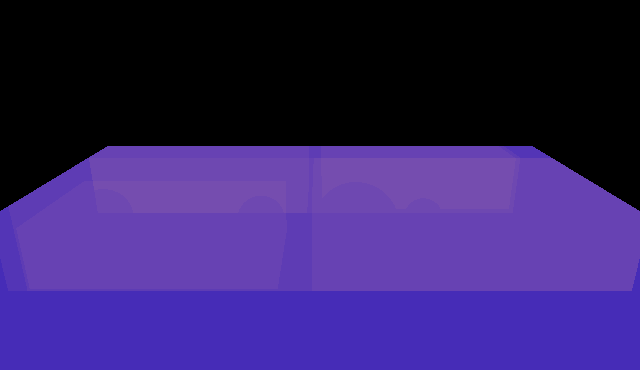
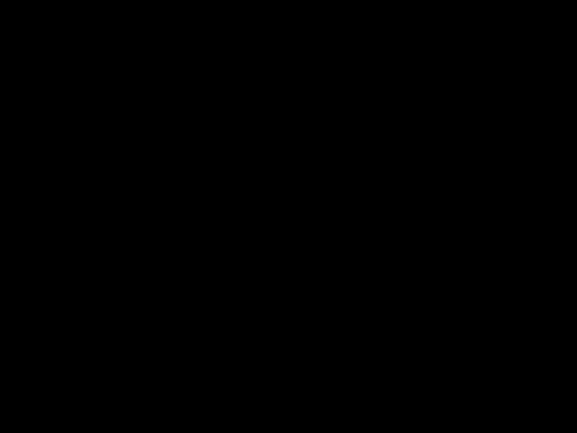

# KairoRayTracer

`KairoRayTracer` is a standalone CPU renderer in the Kairo workspace. It is the
first visible graphics artifact that forces the foundation stack to work
together:

```text
KairoMath -> KairoGeometry -> KairoSpatial -> rendered image
```

The repo is currently in a stabilization freeze: no new integrators, ImGui, GPU,
glTF, or editor systems. The goal of this pass is trust: deterministic renders,
validated settings, reproducible benchmark output, and a developer README with
real images.

## Gallery

| Whitted Cornell | PBR Cornell |
|---|---|
|  |  |

| Path Tracing | Glass Refraction |
|---|---|
|  |  |

| OBJ Mesh | Area Light Soft Shadows |
|---|---|
|  |  |

| BVH Heatmap | Acceleration Difference |
|---|---|
|  |  |

## Quickstart

Build and test with the module-capable LLVM toolchain:

```bash
cd /Users/swayamsingal/Desktop/Programming/Kairo/KairoRayTracer
cmake -S . -B build -G Ninja -DCMAKE_CXX_COMPILER=/opt/homebrew/opt/llvm/bin/clang++
cmake --build build
ctest --test-dir build --output-on-failure
```

Render an image:

```bash
./build/KairoRayTracerCLI scenes/cornell.kairo --mode whitted --output outputs/beauty.png
open outputs/beauty.png
```

Render at a different resolution:

```bash
./build/KairoRayTracerCLI scenes/cornell.kairo --mode whitted --width 1280 --height 720 --output outputs/cornell_720p.png
```

`--width` and `--height` re-render a new film and update camera aspect ratio.
Resizing the preview window only scales the already-rendered texture.

Headless CLI-only build:

```bash
cmake -S . -B build-headless -G Ninja -DCMAKE_CXX_COMPILER=/opt/homebrew/opt/llvm/bin/clang++ -DKAIRO_RAYTRACER_BUILD_PREVIEW=OFF
cmake --build build-headless
```

## Architecture

```text
.kairo scene
  -> SceneParser
  -> materials, lights, primitives, camera, settings
  -> KairoSpatial acceleration structure
  -> Renderer tile loop
  -> integrator/debug mode
  -> Film
  -> PPM/PNG image and optional GLFW preview
```

Core renderer modules do not depend on GLFW or OpenGL. `PreviewWindow.cppm` is
compiled only for `KairoRayTracerPreview` when
`KAIRO_RAYTRACER_BUILD_PREVIEW=ON`.

## Implemented Capabilities

```text
Geometry: spheres, triangles, OBJ meshes converted to triangles
Acceleration: brute force, SAH BVH, Morton-ordered BVH
Lighting: point lights, rectangular area lights, hard and soft shadows
Materials: lambert, mirror, emissive, glass, roughness-metallic PBR
Modes: whitted, pbr, path, normal, depth, shadow_mask, bvh_heatmap,
       albedo, primitive_id, uv, barycentric, accel_diff
Output: PPM, PNG, CSV render stats
Execution: stratified SPP, threaded tiles, deterministic fixed-scene renders
Preview: GLFW image viewer with save, reload, orbit, zoom, and reset controls
```

## Scene DSL

`.kairo` is a strict line-oriented scene format. `#` starts a comment.
Materials must be declared before primitives that reference them.

```text
resolution width height
samples count
background r g b
integrator whitted|pbr|path|normal|depth|shadow_mask|bvh_heatmap|albedo|primitive_id|uv|barycentric|accel_diff
camera px py pz tx ty tz upx upy upz fovDegrees
material name lambert|mirror|emissive r g b [emitR emitG emitB]
material name glass r g b ior
material name pbr r g b roughness metallic
light point x y z r g b intensity
light area px py pz ux uy uz vx vy vz r g b intensity samples
sphere x y z radius materialName
triangle ax ay az bx by bz cx cy cz materialName
obj relative_or_absolute_path materialName scale tx ty tz
```

Example scenes:

```text
cornell.kairo                  Whitted/PBR Cornell-style room
path_showcase.kairo            path tracing smoke and gallery scene
glass_refraction.kairo         glass, refraction, and Fresnel
mesh_showcase.kairo            OBJ loading through triangle primitives
area_light_soft_shadow.kairo   rectangular area light and soft shadows
bvh_stress.kairo               acceleration/debug heatmap scene
```

## Debug Modes

```text
normal       surface normal and winding check
depth        camera framing and hit-distance check
shadow_mask  light visibility and ray-bias check
bvh_heatmap  traversal cost visualization
albedo       material assignment without lighting
primitive_id primitive identity and parser ordering
uv           triangle UV/barycentric preservation
barycentric  triangle interpolation coordinates
accel_diff   BVH-vs-brute correctness image; black means match
```

Generate the main debug set:

```bash
./build/KairoRayTracerCLI scenes/cornell.kairo --mode normal --output outputs/normal.png
./build/KairoRayTracerCLI scenes/cornell.kairo --mode depth --output outputs/depth.png
./build/KairoRayTracerCLI scenes/cornell.kairo --mode shadow_mask --output outputs/shadow_mask.png
./build/KairoRayTracerCLI scenes/bvh_stress.kairo --mode bvh_heatmap --output outputs/bvh_heatmap.png
./build/KairoRayTracerCLI scenes/cornell.kairo --mode accel_diff --output outputs/accel_diff.png
```

## Preview Window

```bash
./build/KairoRayTracerPreview scenes/cornell.kairo --mode whitted
```

Controls:

```text
Esc   close
S     save current film
R     reload and re-render the scene file
Arrows orbit camera around the current focus estimate and re-render
Q/E   zoom orbit camera in/out and re-render
Home  reset preview orbit
```

The preview is a lightweight image viewer, not an editor and not ImGui.

## Benchmark Snapshot

Scene: `scenes/bvh_stress.kairo`  
Primitive count: 17  
Resolution: `640x370`  
SPP: `1`  
Threads: `4`  
Machine/date: local Apple Silicon run during stabilization.

| Mode | Primitives | Resolution | SPP | Threads | Time | Rays/s | Nodes/ray | Tests/ray |
|---|---:|---:|---:|---:|---:|---:|---:|---:|
| Brute force | 17 | 640x370 | 1 | 4 | 185.205 ms | 2.02405e+06 | 0 | 16.8813 |
| BVH SAH | 17 | 640x370 | 1 | 4 | 210.430 ms | 1.78142e+06 | 1.95113 | 2.25284 |
| BVH Morton | 17 | 640x370 | 1 | 4 | 228.282 ms | 1.64211e+06 | 2.24750 | 4.74690 |

Commands:

```bash
./build/KairoRayTracerCLI scenes/bvh_stress.kairo --mode whitted --accel brute --width 640 --height 370 --samples 1 --threads 4 --output outputs/bvh_stress_brute.png --stats outputs/bench_brute.csv
./build/KairoRayTracerCLI scenes/bvh_stress.kairo --mode whitted --accel sah --width 640 --height 370 --samples 1 --threads 4 --output outputs/bvh_stress_sah.png --stats outputs/bench_sah.csv
./build/KairoRayTracerCLI scenes/bvh_stress.kairo --mode whitted --accel morton --width 640 --height 370 --samples 1 --threads 4 --output outputs/bvh_stress_morton.png --stats outputs/bench_morton.csv
```

This benchmark is intentionally reported as a snapshot. With only 17 primitives,
brute force can win wall-clock time because traversal overhead dominates, while
SAH still proves the acceleration structure by cutting primitive tests per ray
from `16.8813` to `2.25284`.

## Stabilization Status

The current test suite covers:

```text
Parser errors with line/column output
Camera center ray
Sphere and triangle hit records
BVH hit equivalence to brute force, including UV/barycentric data
Shadow occlusion
Whitted, PBR, path, OBJ, and area-light render smoke tests
Path determinism and finite/no-NaN pixels
Single-thread versus multi-thread render equality
SPP 1, 4, and 16 render stability
PNG header/dimension output
CSV stats output
Renderer setting validation
CLI invalid numeric override rejection
```

Validation rejects unsafe direct `RenderSettings` values before rendering:

```text
Width == 0
Height == 0
SamplesPerPixel == 0
TileSize == 0
DepthFar <= DepthNear
Width/Height > 32768
SamplesPerPixel > 4096
TileSize > 4096
MaxDepth > 64
ThreadCount > 1024
```

## Deferred

```text
Progressive rendering
HDR output and environment lighting
Texture loading and filtered texture sampling
Normal interpolation from OBJ vertex normals
Per-pixel traversal analytics CSV
Multiple importance sampling
Denoising experiments
ImGui debug/editor UI
GPU backend
glTF loading
```
